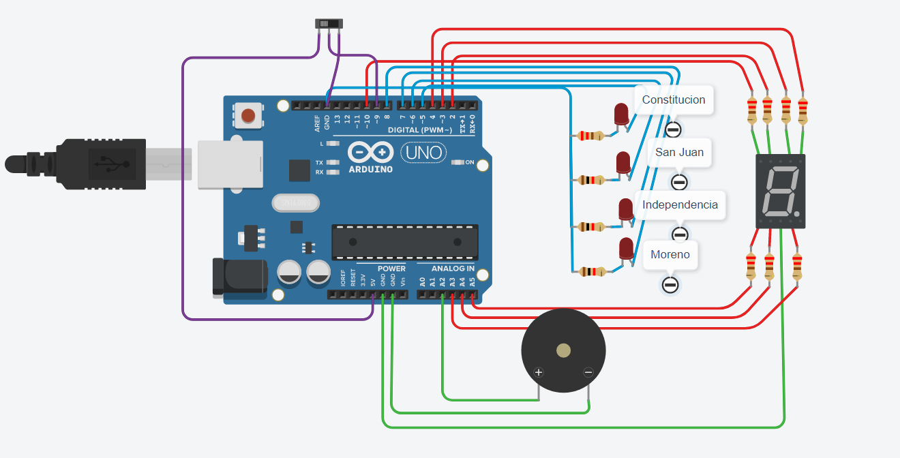

# Data Processing Systems: ARDUINO

## Project: Argentinian Subway C Train

## Description
The project consists of a circuit that, when changing subway stations:

-Changes the corresponding LED.  
-Changes the tone of the Piezo (a sound-generating device).  
-Displays the number of stations remaining until "Moreno."

## Tinkercad Circuit:
You can check this project on Tinkercad by clicking on this link:
[Argentinian Subway C Train](https://www.tinkercad.com/things/daKPoezlP4g)

## CODE EXPLANATION

### 1. DEFINE SECTION AND VOID FUNCTION
In this segment of the code, I use define to assign aliases to certain numeric values I use throughout the code, especially in the void setup function. Then, I use pinMode to set the corresponding pins as inputs or outputs. Additionally, I initialize Serial.begin to enable communication with the console and declare and assign the variable counter to 0.

~~~ C (lenguaje en el que esta escrito)
#define LED_CONSTITUCION 5
#define LED_SAN_JUAN 6
#define LED_INDEPENDENCIA 7
#define LED_MORENO 8
#define LED_G 10
#define LED_F 2
#define LED_A 3
#define LED_B 4
#define LED_E A5
#define LED_D A4
#define LED_C A3
#define RING A2
#define BUTTON 9
int counter = 0;

void setup()
{
  pinMode(LED_CONSTITUCION, OUTPUT);
  pinMode(LED_SAN_JUAN, OUTPUT);
  pinMode(LED_INDEPENDENCIA, OUTPUT);
  pinMode(LED_MORENO, OUTPUT);
  pinMode(LED_G, OUTPUT);
  pinMode(LED_F, OUTPUT);
  pinMode(LED_A, OUTPUT);
  pinMode(LED_B, OUTPUT);
  pinMode(LED_E, OUTPUT);
  pinMode(LED_D, OUTPUT);
  pinMode(LED_C, OUTPUT);
  pinMode(RING, OUTPUT);
  pinMode(BUTTON, OUTPUT);
  pinMode(BUTTON, INPUT);
  pinMode(RING, OUTPUT);
  Serial.begin(9600);
}
~~~

### 2. SHOW DIGIT FUNCTION
The show_digit function takes a parameter, which is the number that the 7-segment display should show. To achieve this, the function uses a switch statement that compares the parameter with different cases within the switch. In each case, the corresponding segments are turned on and off to form the desired digit on the 7-segment display.

~~~C (lenguaje en el que esta escrito)
void show_digit(int digit_to_show)
{ 
  switch (digit_to_show)
  {
	case 0:
    digitalWrite(LED_A, HIGH);
    digitalWrite(LED_B, HIGH);
    digitalWrite(LED_C, HIGH);
    digitalWrite(LED_D, HIGH);
    digitalWrite(LED_E, HIGH);
    digitalWrite(LED_F, HIGH);
    digitalWrite(LED_G, LOW);
    break;
    case 1:
    digitalWrite(LED_A, LOW);
    digitalWrite(LED_B, HIGH);
    digitalWrite(LED_C, HIGH);
    digitalWrite(LED_D, LOW);
    digitalWrite(LED_E, LOW);
    digitalWrite(LED_F, LOW);
    digitalWrite(LED_G, LOW);
    break;
    case 2:
    digitalWrite(LED_A, HIGH);
    digitalWrite(LED_B, HIGH);
    digitalWrite(LED_C, LOW);
    digitalWrite(LED_D, HIGH);
    digitalWrite(LED_E, HIGH);
    digitalWrite(LED_F, LOW);
    digitalWrite(LED_G, HIGH);
    break;
    case 3:
    digitalWrite(LED_A, HIGH);
    digitalWrite(LED_B, HIGH);
    digitalWrite(LED_C, HIGH);
    digitalWrite(LED_D, HIGH);
    digitalWrite(LED_E, LOW);
    digitalWrite(LED_F, LOW);
    digitalWrite(LED_G, HIGH);
    break;
    case -50:
    digitalWrite(LED_A, LOW);
    digitalWrite(LED_B, LOW);
    digitalWrite(LED_C, LOW);
    digitalWrite(LED_D, LOW);
    digitalWrite(LED_E, LOW);
    digitalWrite(LED_F, LOW);
    digitalWrite(LED_G, LOW);
    break;
  }
  return;
}
~~~

### 3. LOOP FUNCTION
The loop function is a type of loop function where, at the beginning, we declare a variable called "button_state," which reads the state of the BUTTON. Therefore, it can have a value of 1 or 0.

If the button is turned on, and thus button_state has a value of 1:
We enter a switch statement, where the value of the counter is compared with the cases.
Upon entering each case:

The show_digit function is called, passing the specified number as an argument to display on the 7-segment display.
The corresponding LED for the station is turned on, and the previous LED is turned off.
The Piezo is activated with different tones for each case (If listened from the beginning to the end, we can hear the Piezo playing the diminished musical scale, generating a characteristic tone throughout the circuit).
The value of the counter is printed to the console.
A delay of 1 second is added.
If the counter is greater than 3, the counter is reset to 0.
If the button is turned off, and thus button_state has a value of 0:

The Piezo is turned off.
The LEDs are turned off.
The show_digit function is called, passing -50 as an argument, which will turn off all LEDs on the 7-segment display.
The counter is reset to 0.

~~~C (lenguaje en el que esta escrito)
void loop()
{
  int button_state = digitalRead(BUTTON);
  
  if (button_state == 1)
  {
    Serial.println("Counter de entrada:");
    Serial.println(counter);
    switch (counter)
  	{
      case 0:
      show_digit(3);
      digitalWrite(LED_MORENO, LOW);
      digitalWrite(LED_CONSTITUCION, HIGH);
      tone(RING, 392);
      delay(1000);
      counter++;
      Serial.println("Counter case 0:");
      Serial.println(counter);
      break;
      case 1:
      show_digit(2);
      digitalWrite(LED_CONSTITUCION, LOW);
      digitalWrite(LED_SAN_JUAN, HIGH);
      tone(RING, 329.63);
      delay(1000);
      counter++;
      Serial.println("Counter case 1:");
      Serial.println(counter);
      break;
      case 2:
      show_digit(1);
      digitalWrite(LED_SAN_JUAN, LOW);
      digitalWrite(LED_INDEPENDENCIA, HIGH);
      tone(RING, 277.18);
      delay(1000);
      counter++;
      Serial.println("Counter case 2:");
      Serial.println(counter);
      break;
      case 3:
      show_digit(0);
      digitalWrite(LED_INDEPENDENCIA, LOW);
      digitalWrite(LED_MORENO, HIGH);
      tone(RING, 233.08);
      delay(1000);
      counter++;
      Serial.println("Counter case 3:");
      Serial.println(counter);
      break;
      default:
      counter = 0;
      Serial.println("Counter case >3:");
      Serial.println(counter);
      break;
  	}
  }
  else
  {
    noTone(RING);
    digitalWrite(LED_MORENO, LOW);
    digitalWrite(LED_CONSTITUCION, LOW);
    digitalWrite(LED_SAN_JUAN, LOW);
    digitalWrite(LED_INDEPENDENCIA, LOW);
    show_digit(-50);
    counter = 0;
  }
}
~~~
---
