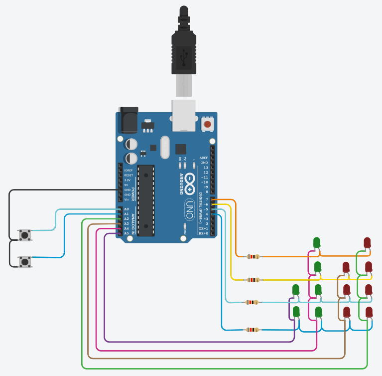

# Data Processing Systems: ARDUINO

## Project: Binary Clock (Exam)

## Description
This project was used as the first exam for the subject, and it consists of a circuit that represents a binary clock, where the time is displayed in binary numbers. The time calculation is performed using the millis() function, which enables precise timekeeping.

Two push buttons, connected to A0 and A1 respectively, allow users to adjust the time. Pressing the button connected to A0 increments the time by 1 minute, while pressing the button connected to A1 decrements the time by 1 minute.

Every time the time is adjusted using a push button, the updated time is displayed on the Serial Monitor, providing real-time feedback to the user.

Additionally, the clock is programmed to handle time transitions between 00:00 and 23:59 seamlessly. When the time is adjusted backward and reaches 00:00, it automatically switches to 23:59. Similarly, when the time is adjusted forward and reaches 23:59, it wraps around to 00:00.

## Tinkercad Circuit:
You can check this project on Tinkercad by clicking on this link: [Binary Clock](https://www.tinkercad.com/things/ggdM0ceMffV)
