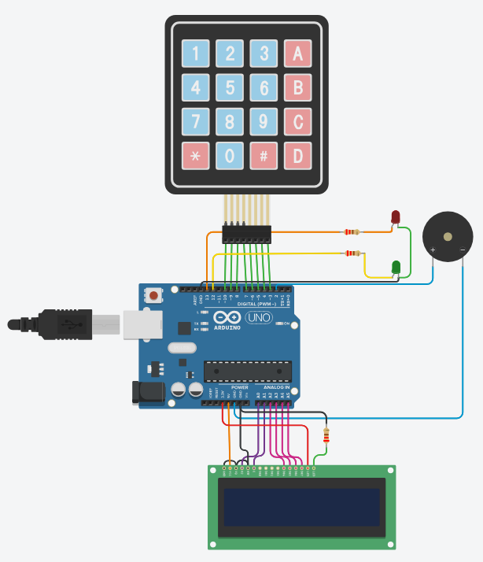

# Data Processing Systems: ARDUINO

## Project: Keypad Alarm System

## Description
The project implements a Security Access Control System using an Arduino board, a 4x4 keypad, and a LiquidCrystal display. The system allows users to enter a predefined password to gain access to a secure area.

Components:
-Arduino board  
-4x4 Keypad  
-LiquidCrystal Display  
-Green LED (Connected to Pin 12)  
-Red LED (Connected to Pin 13)  
-Piezo Buzzer (Connected to Pin 2)

Upon running the system, users are prompted to enter a 4-digit password using the keypad. Each key press is displayed on the LiquidCrystal display, and after entering all four digits, the system validates the entered password.

If the entered password matches the correct password ("5B2A"), the Green LED is turned on, and a pleasant tone is played using the Piezo Buzzer. This indicates successful access, and the system will wait for 5 seconds before resetting.

In case the entered password does not match the correct password, the Red LED is turned on, and a different tone is played using the Piezo Buzzer. This indicates an unsuccessful attempt, and the system will wait for 5 seconds before resetting.

The project provides a simple yet effective security mechanism using the keypad and LED indicators. The LiquidCrystal display allows users to visualize their input, providing a user-friendly experience.

## Tinkercad Circuit:
You can check this project on Tinkercad by clicking on this link: [Keypad Alarm System](https://www.tinkercad.com/things/0T5ju6cH4G4)
