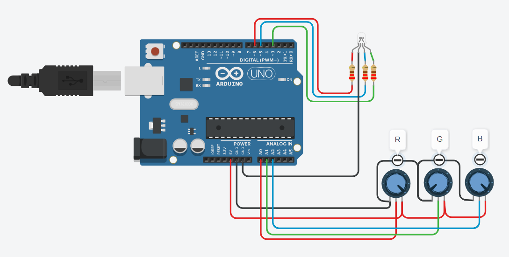

# Data Processing Systems: ARDUINO

## Project: RGB Colors

## Description
The project involves creating an RGB LED Color Mixer using an Arduino board and three potentiometers. The potentiometers are used to adjust the intensity of each color channel (Red, Green, and Blue) independently, allowing users to create custom colors by combining the three primary colors.

Components:
-Arduino board  
-RGB LED (Common Cathode)  
-3x Potentiometers (Connected to A0, A1, and A2 respectively)  
-3x Resistors for the Potentiometers (if needed)  
-Current-Limiting Resistors for the RGB LED (if needed)

The RGB LED has three channels, each controlled by one of the potentiometers. By adjusting the position of each potentiometer, users can set the intensity of the corresponding color channel.

The set_range function is used to map the potentiometer values to a range between 0 and 100. This is done to ensure smooth color transitions and match the output with the RGB LED's intensity control (0 to 255).

The set_color function takes the color channel and the allowed range as inputs and uses the analogWrite function to control the brightness of the respective LED channel. The allowed range value, derived from the potentiometer state, determines the intensity of the color.

In the loop function, the potentiometer states for each color channel are continuously read. The set_range function is then used to convert the potentiometer values to appropriate ranges, and the set_color function is called for each RGB LED channel to set the desired color based on the potentiometer positions.

The project provides an interactive and visual way for users to experiment with RGB colors and learn about color mixing principles. It can be a fun addition to various projects involving lighting and visual displays.

## Tinkercad Circuit:
You can check this project on Tinkercad by clicking on this link: [RGB Colors](https://www.tinkercad.com/things/7caxkMpk3Nj)
