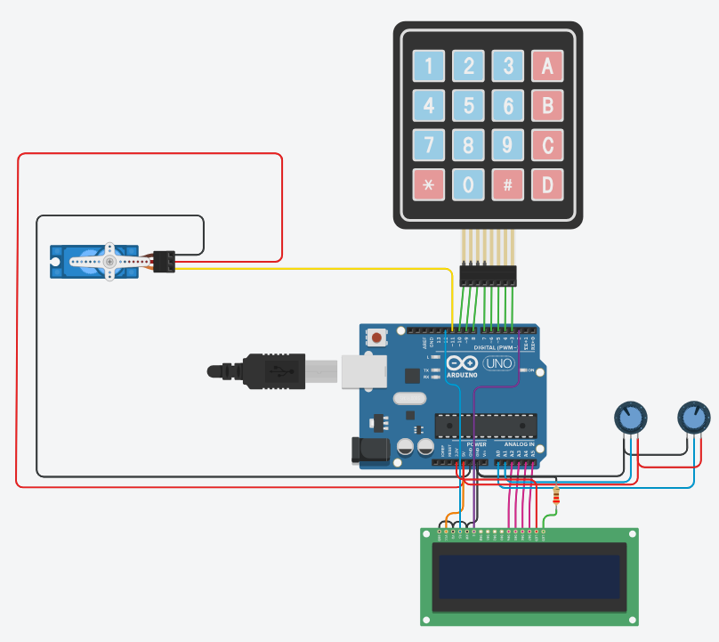

# Data Processing Systems: ARDUINO

## Project: Servo+Display+Keypad System (Exam)

## Description
This project was used as my second exam and it involves creating a servo position control system using an Arduino board, a Liquid Crystal Display (LCD), a keypad, and a servo motor. The system allows users to set minimum and maximum positions for the servo motor using two potentiometers. The servo motor's position can be adjusted and controlled using various keypad inputs.

Components:
-Arduino board  
-LCD display (16x2)  
-Keypad (4x4)  
-Servo motor

The project utilizes a 4x4 keypad to receive user inputs and perform corresponding actions. Each key on the keypad is associated with specific functions as follows:

-Key 'A': Set minimum and maximum positions based on the potentiometer readings.  
-Key 'B': Move the servo motor to the minimum position.  
-Key 'C': Move the servo motor to the maximum position.  
-Key 'D': Set the minimum position to 0 degrees.  
-Key '*': Set the maximum position to 180 degrees.  
-Key '1': Print the current minimum potentiometer reading.  
-Key '2': Print the current maximum potentiometer reading.  
-Key '3': Print the current position of the servo motor corresponding to the minimum position.  
-Key '4': Print the current position of the servo motor corresponding to the maximum position.  
-Key '5': Move the servo motor to 90 degrees (ignoring the cursor).

The analog readings from the potentiometers for minimum and maximum positions are mapped to values between 0 and 180 degrees to control the servo motor's range of motion. If the maximum position value is less than the minimum position value, it adopts the value of the minimum position, ensuring that the servo motor's motion remains within the correct range.

The perform_action_according_to_pressed_key function is responsible for interpreting the keypad inputs and taking appropriate actions based on the pressed key.

The display_info function is used to display various information on the LCD, including the minimum and maximum potentiometer readings, minimum and maximum servo positions, and the cursor's current position (in degrees).

This project provides an interactive interface for users to control and configure the servo motor's motion range, making it a useful tool for various robotics and automation projects.

## Tinkercad Circuit:
You can check this project on Tinkercad by clicking on this link: [Servo+Display+Keypad System](https://www.tinkercad.com/things/iYSIBPHvWX1)
