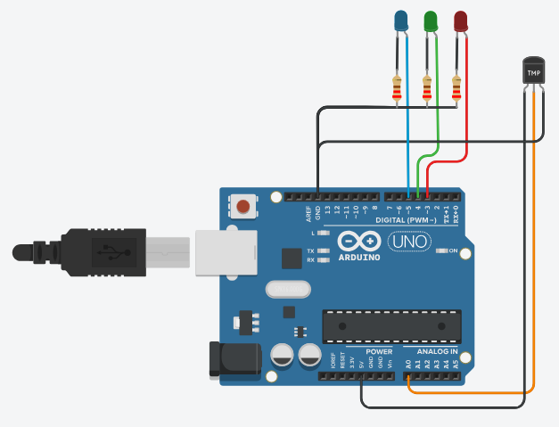

# Data Processing Systems: ARDUINO

## Project: Temperature Sensor

## Description
This project involves creating a temperature-dependent RGB LED control system using an Arduino board and a temperature sensor. The system measures the temperature using an analog temperature sensor and adjusts the RGB LED color based on the temperature value.

Components:  
-Arduino board  
-RGB LED (common cathode)  
-Temperature sensor

The project uses an analog temperature sensor to measure the ambient temperature. The analog reading from the temperature sensor is mapped to a temperature range of -40°C to 125°C to accurately represent the temperature value.

The RGB LED has three color components: red, green, and blue. The system uses these three color components to display different colors based on the temperature reading. The temperature range is divided into three segments:

1. If the temperature is below 0°C, the RGB LED emits a blue color to indicate low temperatures.
2. If the temperature is between 0°C and 30°C (inclusive), the RGB LED emits a green color to indicate moderate temperatures.
3. If the temperature is above 30°C, the RGB LED emits a red color to indicate high temperatures.

The turnOnLED function is used to control the RGB LED's colors based on the temperature conditions. The function takes three parameters representing the states of the red, green, and blue components of the RGB LED. By setting these parameters, the function can activate the appropriate color component to achieve the desired color.

The temperature value is continuously read and updated in the loop function. Depending on the temperature reading, the corresponding color is displayed on the RGB LED. Additionally, the temperature value is printed to the Serial Monitor for monitoring purposes.

This project provides a visual representation of temperature levels through RGB LED colors, making it a useful tool for various temperature-related applications, such as weather monitoring systems or temperature-sensitive devices.

## Tinkercad Circuit:
You can check this project on Tinkercad by clicking on this link: [Temperature Sensor](https://www.tinkercad.com/things/2mFQzoxEDwF)
